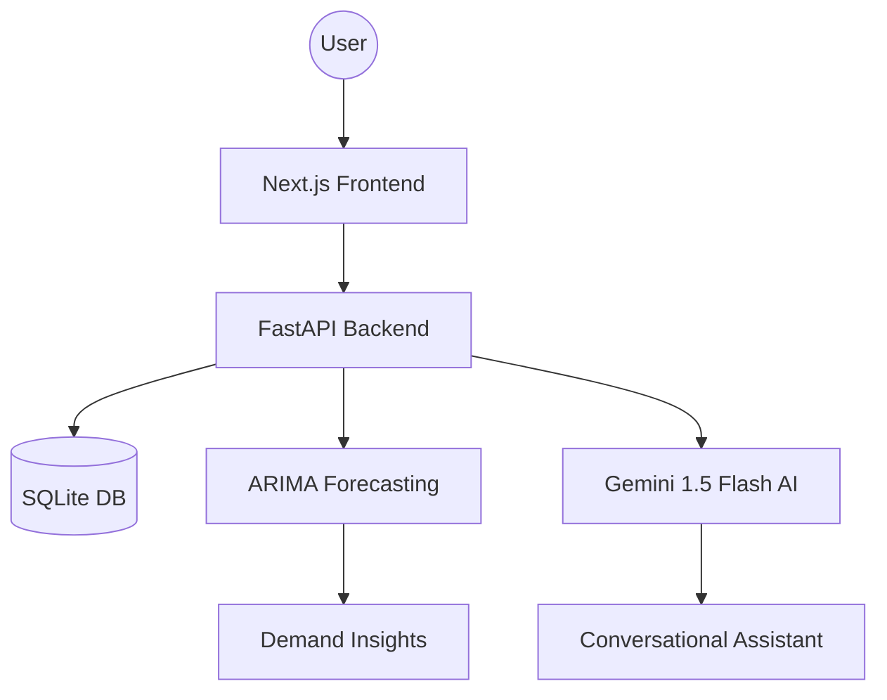

<div align="center">

# ShelfMind AI 🚀
##The Intelligent Operating System for Modern Retailers

[](https://github.com/Armantech10/shelfmind-ai)
[](https://github.com/Armantech10/shelfmind-ai)
[](https://github.com/Armantech10/shelfmind-ai)
[](https://github.com/Armantech10/shelfmind-ai)

**ShelfMind AI** is an ultra-premium, intelligent inventory and demand-forecasting SaaS platform. It combines classical statistical forecasting (ARIMA) with state-of-the-art Generative AI (Gemini 1.5 Flash) to help retailers eliminate stockouts and optimize inventory overhead.

[Explainer Video](https://github.com/Armantech10/shelfmind-ai) • [Live Demo](https://github.com/Armantech10/shelfmind-ai) • [Documentation](https://github.com/Armantech10/shelfmind-ai)

</div>

---

## ✨ Key Features

- **🧠 Demand Forecasting:** Automated ARIMA models trained on historical sales to predict future needs with precision.
- **⚡ Smart Reorder Engine:** Real-time stock level monitoring with automated reorder point calculations based on safety stock and stockout risk.
- **📊 AI Business Insights:** Transform complex inventory data into actionable executive summaries using Gemini 1.5 Flash.
- **💬 Conversational Assistant:** Chat directly with your inventory. Ask things like *"Which products should I reorder today?"* or *"What was my revenue trend last month?"*.
- **🔔 Proactive Alerts:** Background scanning flags low stock, expiry warnings, and demand spikes before they become problems.
- **📱 Premium Experience:** A high-performance, responsive dashboard built with Next.js 14 and Framer Motion.

---

## 🛠 Tech Stack

### Frontend
- **Framework:** Next.js 14+ (App Router)
- **Styling:** Tailwind CSS (Premium Dark Mode)
- **Animations:** Framer Motion
- **Data Viz:** Recharts (Interactive Area & Bar Charts)

### Backend
- **Core:** FastAPI (Python 3.10+)
- **Database:** SQLAlchemy with SQLite/PostgreSQL
- **AI/ML:** Statsmodels (ARIMA), Google Gemini 1.5 Flash API
- **Processing:** Pandas & NumPy

---

## 🏗 System Architecture



---

## 🚀 Quick Start

### 🐳 Using Docker (Recommended)

1. Clone the repository:
   ```bash
   git clone https://github.com/Armantech10/shelfmind-ai.git
   cd shelfmind-ai
   ```

2. Configure Environment:
   ```bash
   cp .env.example .env
   # Add your GEMINI_API_KEY to the .env file
   ```

3. Launch:
   ```bash
   docker-compose up --build
   ```

### 🛠 Manual Setup

#### Backend
```bash
cd backend
pip install -r requirements.txt
python seed.py  # Populate demo data
uvicorn main:app --reload
```

#### Frontend
```bash
cd frontend
npm install
npm run dev
```

---

## 🔑 Environment Variables

| Variable | Description | Default |
|----------|-------------|---------|
| `SECRET_KEY` | JWT signing key for auth | `shelfmind-super-secret` |
| `GEMINI_API_KEY` | Google AI Studio API Key | Required |
| `DATABASE_URL` | SQLite or PostgreSQL connection string | `sqlite:///./shelfmind.db` |
| `NEXT_PUBLIC_API_URL`| Backend API Endpoint | `http://localhost:8000` |

---

## 📸 Screenshots

<div align="center">

### Landing Page


### Dashboard


### Sales Forecasts


### AI Insights


### AI Assistant


</div>

---

## ⚖️ License

Distributed under the MIT License. See `LICENSE` for more information.

---

<div align="center">
Built with ❤️ for the future of retail.
</div>
